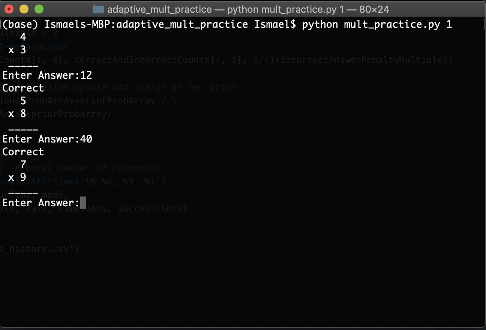

# Mult Practice


[](https://www.python.org/)

Adaptive Mult Practice is a Command Line Tool for training up your [mathemagician](https://www.youtube.com/watch?v=1JW9BA57aR8) capabilities.

Screen Shot of it in action:



## Features

- 3 difficulty modes
  - easy: practice with two integers between 1 and 9
  - medium: practice with one integer between 1 and 9 and the other between 10 and 99
  - hard: practice with two integers between 10 and 99
- Performance report:
  - A summary spreadsheet specifying each problem encountered, the time taken on each problem, and wether each problem was answered correctly is produced for each session
- Adaptive difficulty:
  - Mult Practice learns and identifies problems that the user needs more practice automatically and targets those problems
    - Uses Bayesian reweighting to learn the users strengths and weaknesses
    - Weak areas are those that the user answers incorrectly or those answered correctly but with a significant amount of time taken

## Requirements

- Python

## Getting started

Clone this repository:

```shell
git clone https://github.com/isjxique/adaptive_mult_practice.git
```

Install the requirements:

```shell
pip install requirements.txt
```

## Usage

Use Adpative Mult Practice by specifying the difficulty:

```shell
python mult_practice.py 1
```

or

```shell
python mult_practice.py 2
```

or

```shell
python mult_practice.py 3
```
